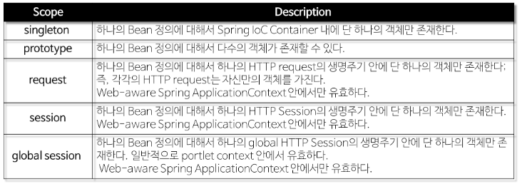
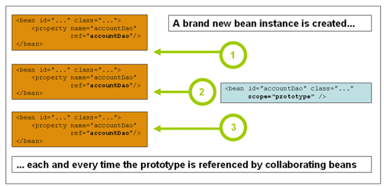

## Spring Bean 이란?


- Spring에서 POJO(Plain, Old Java Object)를 Bean이라고 함.
- 애플리케이션의 핵심을 이루는 객체 -> Spring loC(Inversion of Control) 컨테이너에 의해 인스턴스화, 관리, 생성됨.
- 컨테이너에 공급하는 설정 메타 데이터(XML)에 의해 생성
  - 컨테이너는 메타 데이터를 통해 Bean의 생성, Bean Life Cycle, Bean Dependency(종속성)등을 알 수 있다.
- 애플리케이션의 객체가 지정되면, 해당 객체는 getBean()메서드를 통해 가져올 수 있음

## 주요 속성

- class(필수): 정규화된 자바 클래스 이름
- id: Bean의 고유 식별자
- scope: 객체의 범위(Singleton, prototype)
- constructor-arg: 생성시 생성자에 전달할 인수
- property: 생성시 bean setter에 전달할 인수
- init method and destroy method

```xml
<!-- A simple bean definition -->
<bean id="..." class="..."></bean>

<!-- A bean definition with scope-->
<bean id="..." class="..." scope="singleton"></bean>

<!-- A bean definition with property -->
<bean id="..." class="...">
	<property name="message" value="Hello World!"/>
</bean>

<!-- A bean definition with initialization method -->
<bean id="..." class="..." init-method="..."></bean>

```

## Spring Bean Scope

- Spring은 기본적으로 모든 bean을 singleton으로 생성하여 관리

  - 애플리케이션 구동 시 JVM 안에서 Spring이 bean마다 하나의 객체를 생성하는 것! - So, Spring 을 통해서 제공 받은 bean은 항상 동일한 객체라고 가정한다.
    
  - Singleton - singleton Bean은 Spring 컨테이너에서 **한 번**생성
  - 컨테이너 삭제 시 -> Bean도 제거됨 - 생성된 하나의 인스턴스는 single beans cache에 저장됨 -> 해당 bean에 대한 요청 또는 참고가 있으면 -> 캐시된 객체를 반환 -> 하나만 생성 되기 때문에 동일한 것을 참조 - 기본적으로 모든 bean은 scope이 명시 되지 않을경우 -> singleton이다.
    ! [SingletonApperance](images/SingletonApperance.png)
  - xml 설정: <bean id ="..." class="..." scope="singleton"></bean>
  - anotation 설정: 대상 클라스에 @Scope("singleton")

## Prototype

- bean의 모든 요청에서 새로운 객체를 생성한다.
  - prototype bean은 의존성 관계의 bean에 주입될 때 새로운 객체가 생성되어 주입된다.
  - 정상적인 방식으로 gc(Garbage Collection)에 의해 bean이 제거 된다.
    
  - xml 설정: <bean id ="..." class="..." scope="prototype"></bean>
  - anotation 설정: 대상 클라스에 @Scope("prototype")

## When Singleton or Prototype?

- Good for Sigleton Object

  - 상태가 없는 공유 객체: 상태를 가지고 있지 않는 객체는 동기화 비용이 없음 -> So, 매번 이 객체를 참조하는 곳에서 새로운 객체를 생성할 이유가 X -읽기용으로만 상태를 가진 공유 객체: 읽기전용이므로 동기화 비용 X -> 매 요청마다 새로운 객체 생성 필요 X
  - 공유가 필요한 상태를 지닌 공유 객체: 객체 간의 반드시 공유해야 할 상태를 지닌 객체가 하나 있다면 -> 이 경우에 해당 상태의 쓰기를 가능한 동기화 할 경우 Singleton도 적합.
  - 쓰기가 가능한 상태를 지니면서 and 사용빈도가 매우 높은 객체: 애플리케이션 안에서 사용빈도가 높다면 -> 쓰기 접근에 대한 동기화 비용을 감안하고서라도 singleton을 고려할만함
    - 장시간에 걸쳐 매우 많은 객체가 생성될 때, 해당 객체가 매우 작은 양의 쓰기 상태를 가지고 있을 때, 객체 생성 비용이 매우 클 때 유용하다.

- Good for Non-Singleton Object
  - 쓰기가 가능한 상태를 지닌 객체: 쓰기가 가능한 상태가 많아서 동기화 비용이 > 객체 생성 비용보다 크면 -> 싱글톤은 적합하지 X
  - 상태가 노출되지 않는 객체: 일부 제한적인 경우, 내부상태를 외부에 노출하지 않는 bean을 참조하여 다른 의존 객체와는 독립적으로 작업을 수행하는 객체가 있다면 -> 싱글톤 보다 - 비 싱글톤 객체 사용이 유리하다.

## Example of Singleton and Prototype

```java
PetOwner Class
package com.spring;

public class PetOwner {
    String userName;
    public AnimalType animal;

    public PerOwner(AnimalType animal) { this.animal = animal; }

    public String getUserName() {
        System.out.println("Person name is " + , userName);
        return userName;
    }
    public void setUserName(String userName) { this.userName = userName; }

    public void play() { animal.sound(); }
}


MainApp Class
package com.spring;

import org.springframework.context.support.ClassPathXmlApplicationContext;

public class MainApp {
    public static void main(String[] args) {
        /* main함수에서 Contaier를 생성 */
        // 설정 파일은 인자로 넣고, 해당 설정 파일에 맞게 bean들을 만든다.
        ClassPathXmlApplicationContext context = new ClassPathXmlApplicationContext("com/spring/beans/bean.xml");

        // getBean()을 통해 bean의 주소값을 가져온다.
        PetOwner person1 = (PerOwner) context.getBean("petOwner");
        person1.setUserName("Alice");
        person1.getUserName();

        PetOwner person2 = (PerOwner) context.getBean("petOwner");
        person2.getUserName();

        context.close();
    }
}
```

```xml
bean.xml
<?xml version="1.0" encoding="UTF-8"?>
<beans xmlns="http://www.springframework.org/schema/beans"
      xmlns:xsi="http://www.w3.org/2001/XMLSchema-instance"
      xmlns:context="http://www.springframework.org/schema/context"
      xsi:schemaLocation="http://www.springframework.org/schema/beans http://www.springframework.org/schema/beans/spring-beans.xsd
            http://www.springframework.org/schema/context http://www.springframework.org/schema/context/spring-context-3.2.xsd">

    <bean id="dog" class="com.spring.Dog">
        <property name="myName" value="poodle"></property>
    </bean>

    <bean id="cat" class="com.spring.Cat">
        <property name="myName" value="bella"></property>
    </bean>

    <bean id="petOwner" class="com.spring.PetOwner" scope="singleton">
        <constructor-arg name="animal" ref="dog"></constructor-arg>
    </bean>
</beans>
```

참고: https://gmlwjd9405.github.io/2018/11/10/spring-beans.html
