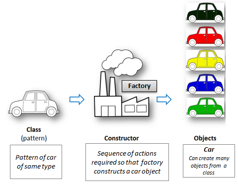
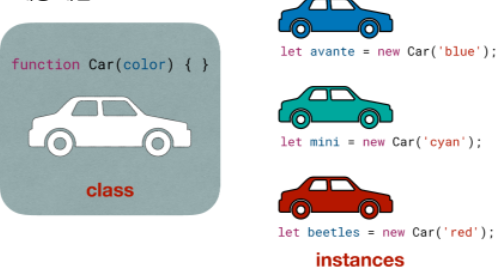

## 1. 목적

OOP(Object-oriented programming)란 무엇인가? 자바스크립트 기준으로 살펴본다.

---

## 2. 내용

객체지향 프로그래밍은 사람이 세계를 보고 이해하는 것과 비슷하다.
-> 코드를 추상화하여 직관적으로 생각할 수 있다.
-> Java, C#에서는 철저하게 OOP를 적용했다.  
OOP는 데이터와 기능을 한곳에 묶어서 처리한다.
-> 속성(Property)과 메서드가 하나의 객체라는 개념에 포함된다.
-> 자바스크립트에서는 클래스(Class)라는 이름으로 부른다.  
-> OOP는 하나의 모델이 되는 청사진을 만들고, 그 청사진을 바탕으로 한 객체를 만드는 프로그래밍 패턴이다.

### 2.1 클래스와 인스턴스

## 

## 

## 

- 하나의 모델이 되는 청사진 -> class
- 그 청사진을 바탕으로 만들어지는 객체 -> instance
- ES5에서는 function함수형으로 class를 정의했지만, ES6에서는 class라는 키워드로 정의할 수 있다.

```js
function Car(name, color) {}

class Car {
  constructor(name, color) {}
}
```

- **Attribute(속성) 정의하기**  
  this를 사용해서 인스턴스 객체를 생성 한다. constructor에서 받아온 parameter에 새로운 값을 부여한다.

```js
class Car {
  constructor(name, color) {
    this.name = 'avante';
    this.color = 'red';
  }
}
```

- **Method 정의하기**  
  ES5에서는 prototype이라는 키워드를 이용해서 메소드를 정의 했다.  
  ES6부터는 prototype 없이도 메소드 정의가 가능해졌다.

```js
function Car(name, color) {
  Car.prototype.refuel = function () {};
}

class Car{
    constructor(name, color) {
        refuel(){}
        }
    }
}

// 인스턴스 생성
let avante = new Car('avante', 'red');
avante.color;
avante.refuel();
```

### 2.2 OOP 특징

- 프로그램 설계 철학 중 하나다 -> 정답이 아니다.
- 모든 것은 객체로 그룹화된다. -> 데이터와(속성) 기능(메소드)가 함께 있다.
- 4가지 주요 개념을 통해서 재사용성을 얻을 수 있다.

  - 캡슐화(Encapsulation)

    - 데이터(속성)과 기능(메소드)를 하나의 단위로 묶는것
    - 은닉(hiding) -> 구현은 숨기고 동작은 노출 시킴
    - 느슨한 결합(Loose Coupling)에 유리 -> 언제든지 구현을 수정할 수 있음 -> 속성과 메소드를 통해서 동작을 한곳으로 모으고 -> 코드만 보고도 인스턴스 객체의 기능을 상상할 수 있게 작성한 것

  - 추상화(Abstraction)
    - 내부 구현은 복잡한데 -> 실제로 노출되는 부분은 단순하게 만든다는 개념 -> 클래스 정의할 때, 메소드와 속성만 정의한 것 -> 인터페이스가 즉 추상화다.
  - 상속(Inheritance)

    - 부모 클래스의 특징을 자식 클래스가 물려 받는 것 -> base class 에서 derive class로 상속되는 것

  - 다형성(Polymorphism)

    - 다향한 형태를 가질 수 있다. -> 예를들어 HTML Element들 내부적으로 화면에 뿌리는 메소드가 존재한다. -> 만약 언어 자체에서 화면에 뿌리는 메소드가 제공되지 않는다면 하나하나 다르게 만들어야 할 것이다. -> 그러나 부모가 갖고 있는 것이 효율적이고 합리적이다.

  - 장점
    - 캡슐화: 복잡하지 않게 만들고, 재사용성을 높인다.
    - 추상화: 코드가 복잡하지 않게 만들고 단순화된 사용으로 변화에 대한 영향을 최소화한다.
    - 상속: 불필요한 코드를 줄여 재사용성 높인다.
    - 다형성: 동일한 메소드에 대해서 객체의 특성에 맞게 달리 작성하는게 가능해진다.
